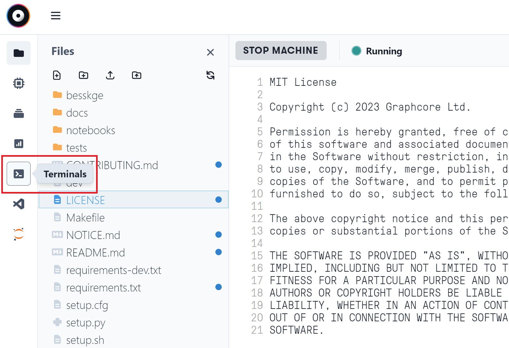

# How to contribute to the BESS-KGE project

You can contribute to the development of the BESS-KGE project, even if you don't have access to IPUs (you can use the [IPUModel](https://docs.graphcore.ai/projects/poptorch-user-guide/en/3.2.0/reference.html#poptorch.Options.useIpuModel) to emulate most functionalities of the physical hardware). 

## VS Code server on Paperspace

Setting up a VS Code server on [Paperspace](https://www.paperspace.com/graphcore) will allow you to tunnel into a machine with IPUs from the VS Code web editor or the desktop app. This requires minimum effort and is an excellent solution for developing and testing code directly on IPU hardware.

You can launch a 6-hours session on a Paperspace machine with access to 4 IPUs **for free** by clicking on the button [](https://console.paperspace.com/github/graphcore-research/bess-kge?container=graphcore%2Fpytorch-paperspace%3A3.3.0-ubuntu-20.04-20230703&machine=Free-IPU-POD4)

Start the machine and open up a terminal from the left pane.



In the terminal, run the command
```shell
bash .gradient/launch_vscode_server.sh {tunnel-name}
```

where `tunnel-name` is an optional argument that you can use to define the name of the remote tunnel (if not set, it will default to `ipu-paperspace`).

The script will download and install all dependencies and start the tunnel. You will be asked to authorize the tunnel through GitHub, before being provided with the tunnel link. Please refer to [this notebook](https://ipu.dev/fmo4AZ) for additional details on these steps and to connect the VS Code desktop app to the remote tunnel. 

Once VS Code is connected to the Paperspace machine, run `./dev build` to build all custom ops. You are now ready to create a new git branch and start developing!

When closing a session and stopping the Paperspace machine, remember to unregister the tunnel in VS Code as explained in the "Common Issues" paragraph of the [notebook](https://ipu.dev/fmo4AZ). To resume your work, just access the clone of the BESS-KGE repo in the "Projects" section of your Paperspace profile, start a new machine and repeat the operations above. All code changes to the local repo, as well as VS Code settings and extensions installed, will persist across sessions.

## Setup on local machine

To develop on a local machine, first install the Poplar SDK following the instructions in the [Getting Started guide for your IPU system](https://docs.graphcore.ai/en/latest/getting-started.html#getting-started).

Then, enable the Poplar SDK, create and activate a Python `virtualenv` and install the PopTorch wheel and all the necessary dependencies: 

```shell
python3.8 -m venv .venv
# Add to .venv/bin/activate
# source /PATH_TO_POPLAR_SDK/enable
source .venv/bin/activate
```
```shell
pip install wheel
pip install $POPLAR_SDK_ENABLED/../poptorch-*.whl
pip install -r requirements-dev.txt
```

Finally, build all custom ops by running `./dev build`

## Tips

Run `./dev --help` for a list of dev options. In particular, use `./dev ci` to run all CI checks locally. Run individual tests with pattern matching filtering `./dev tests -k FILTER`.

Add `.cpp` custom ops to `besskge/custom_ops`. Also, update the [Makefile](Makefile) when adding custom ops.
