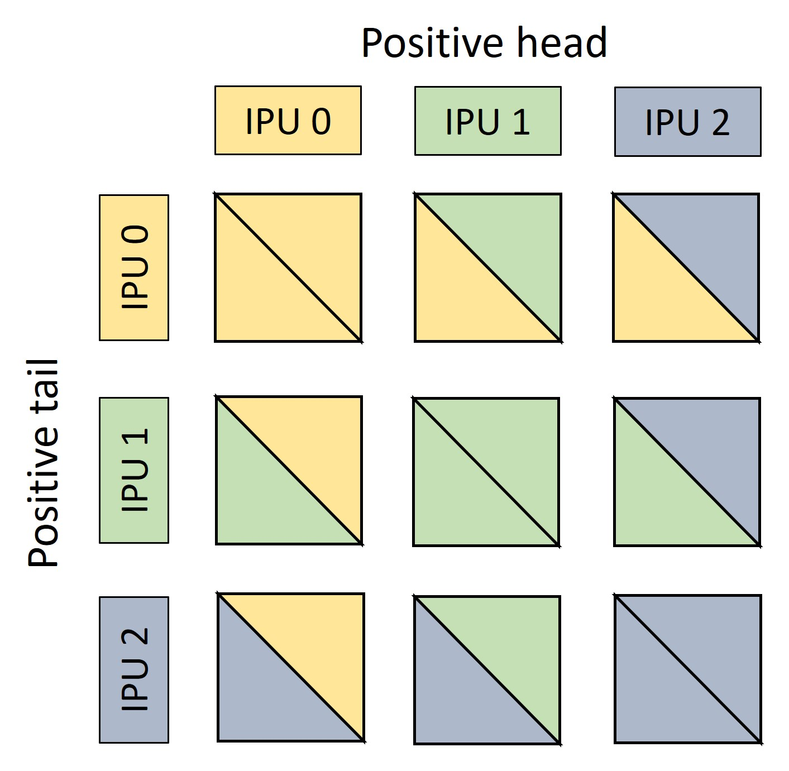
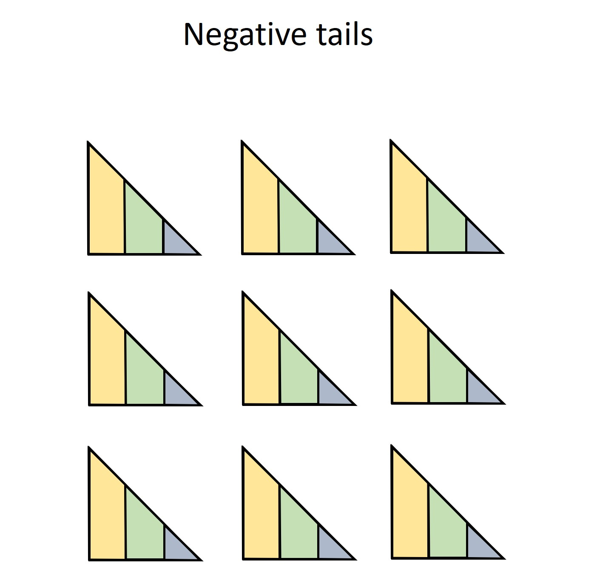

# BESS-KGE


[**Install guide**](#usage)
| [**Tutorials**](#paperspace-notebook-tutorials)
| [**Documentation**](https://symmetrical-adventure-69267rm.pages.github.io/)


BESS-KGE is a PyTorch library for Knowledge Graph Embedding models on IPU implementing the distribution framework [BESS](https://arxiv.org/abs/2211.12281), with embedding tables stored in IPU SRAM.

## Features and limitations

Shallow KGE models are typically memory-bound, as little compute needs to be performed to score (h,r,t) triples once the embeddings of entities and relation types used in the batch have been retrieved. 
BESS (Balanced Entity Sampling and Sharing) is a KGE distribution framework designed to maximize bandwith for gathering the embeddings, by 
* storing them in fast-access IPU on-chip memory;
* minimizing communication time for sharing embeddings between workers, leveraging balanced collective operators over high-bandwith IPU-IPU links.

This allows BESS-KGE to achieve high throughput for both training and inference.

### BESS overview

When distributing the workload over $n$ workers (=IPUs), BESS randomly splits the entity embedding table in $n$ shards of equal size, each of which is stored in one of the workers' memory. The embedding table for relation types, on the other hand, is replicated across workers, as it is usually much smaller.

<figure align="center">
  
  <figcaption>
  
  **Figure 1**. Entity table sharding across $n=3$ workers
  
  </figcaption>
</figure>

The entity sharding induces a partitioning of the triples in the dataset, according to the shard-pair of head entity and tail entity. At execution time (for both training and inference) batches are constructed by sampling triples uniformly from each of the $n^2$ shard-pairs. Negative entities, used to corrupt the head or tail of a triple in order to construct negative samples, are also sampled in a balanced way.

<div id="figure2">
<figure align="center">
  
  
  <figcaption>
  
  **Figure 2**. *Left*: a batch is made of $n^2=9$ blocks, each containing the same number of triples. The head embeddings of triples in block $(i,j)$ are stored on worker $i$, the tail embeddings on worker $j$, for $i,j = 0,1,2$. *Right*: the negative entities used to corrupt triples in block $(i,j)$ are sampled in equal number from all of the $n$ shards (this may require padding). In this example, negative samples are constructed by corrupting tails.
  
  </figcaption>
</figure>
</div>

This batch cook-up scheme allows us to balance workload and communication across workers. First, each worker needs to gather the same number of embeddings from its on-chip memory, both for positive and negative samples. These include the embeddings neeeded by the worker itself, and the embeddings needed by its peers.

<figure align="center">
  
  <figcaption>
  
  **Figure 3**. The required embeddings are gathered from the IPUs' SRAM. Each worker needs to retrieve the head embeddings for $n$ positive triple blocks, and the same for tail embeddings (the $3 + 3$ triangles of same colour in [Figure 2 (left)](#figure2)). In addition to that, the worker gathers the portion (=$1/3$) stored in its memory of the negative tails needed by all of the $n^2$ blocks.
  
  </figcaption>
</figure>

The batch in [Figure 2](#figure2) can then be reconstrcuted by sharing the embeddings of positive **tails** and negative entities between workers through a balanced AllToAll collective operator. Head embeddings remain inplace, as each triple block is then scored on the worker where the head embedding is stored.

<figure align="center">
  
  <figcaption>
  
  **Figure 4**. Embeddings of positive and negative tails are exchanged between workers with an AllToAll collective (red arrows), which effectively transposes rows and columns of the $n^2$ blocks in the picture. After this exchange, each worker has the correct $n$ blocks of positive triples and $n$ blocks of negative tails to compute positive and negative scores.
  
  </figcaption>
</figure>

### Modules

All APIs are documented [here]((https://symmetrical-adventure-69267rm.pages.github.io/)).

| API | Functions 
| --- | --- |
| [`besskge.dataset`](besskge/dataset.py) | Build, save and load KG datasets as collections of (h,r,t) triples.|
| [`besskge.sharding`](besskge/sharding.py) | Shard embedding tables and triple sets for distributed execution.|
| [`besskge.embedding`](besskge/embedding.py) | Utilities to initialize entity and relation embedding tables.|
| [`besskge.negative_sampler`](besskge/negative_sampler.py) | Sample entities to use as corrupted heads/tails when constructing negative samples. Negative entities can be sampled randomly, based on entity type or based on the triple to corrupt.|
| [`besskge.batch_sampler`](besskge/batch_sampler.py) | Sample batches of positive and negative triples for each processing device, according to the BESS distribution scheme.|
| [`besskge.scoring`](besskge/scoring.py) | Functions used to score positive and negative triples for different KGE models, e.g. TransE, ComplEx, RotatE, DistMult.|
| [`besskge.loss`](besskge/loss.py) | Functions used to compute the batch loss based on positive and negative scores, e.g. log-sigmoid loss, margin ranking loss.|
| [`besskge.metric`](besskge/metric.py) | Functions used to compute metrics for the predictions of KGE models, e.g. MRR, Hits@K.|
| [`besskge.bess`](besskge/bess.py) | PyTorch modules implementing the BESS distribution scheme for KGE training and inference on multiple IPUs. |
| [`besskge.utils`](besskge/utils.py) | General puropose utilities.|

### Known limitations

* BESS-KGE supports distribution up to 16 IPUs.
* Storing embeddings in SRAM introduces limitations on the size of the embedding tables, and therefore on the entity count in the KG. Using the optimizer Adam, float32 weights and an embedding size of 128, this limit can be quantified in ~4M entities when sharding tables across 16 IPUs.
* No support for FP16 weights.
* `besskge.bess.TopKQueryBessKGE` currently cannot be used with distance-based scoring functions (e.g. TransE, RotatE).

## Usage

Tested on Poplar SDK 3.2.0+1277, Ubuntu 20.04, Python 3.8

1\. Install Poplar SDK following the instructions in the Getting Started guide for your IPU system. More detailed instructions on setting up your Poplar environment are available in the [Poplar quick start guide](https://docs.graphcore.ai/projects/poplar-quick-start).

2\. Create a virtualenv with PopTorch:
```shell
source <path to Poplar installation>/enable.sh
source <path to PopART installation>/enable.sh
python3.8 -m venv .venv
source .venv/bin/activate
pip install wheel
pip install $POPLAR_SDK_ENABLED/../poptorch-*.whl
```

3\. Pip install BESS-KGE:
```shell
pip install git+ssh://git@github.com/graphcore-research/bess-kge.git
```

4\. Import and use:
```python
import besskge
```

## Paperspace notebook tutorials

For a walkthrough of the library functionalities, see our jupyter notebooks (better if in the suggested sequence): 
1. [KGE training and inference on the OGBL-BioKG dataset](notebooks/1_biokg_training_inference.ipynb) [](https://console.paperspace.com/github/graphcore-research/bess-kge?container=graphcore%2Fpytorch-jupyter%3A3.2.0-ubuntu-20.04&machine=Free-IPU-POD4&file=%2Fnotebooks%2F1_biokg_training_inference.ipynb)
2. [Link prediction on the YAGO3-10 dataset](notebooks/2_yago_topk_prediction.ipynb) [](https://console.paperspace.com/github/graphcore-research/bess-kge?container=graphcore%2Fpytorch-jupyter%3A3.2.0-ubuntu-20.04&machine=Free-IPU-POD4&file=%2Fnotebooks%2F2_yago_topk_prediction.ipynb)


## Contributing

See [CONTRIBUTING.md](CONTRIBUTING.md)

## References
BESS: Balanced Entity Sampling and Sharing for Large-Scale Knowledge Graph Completion ([arXiv](https://arxiv.org/abs/2211.12281))

## License

Copyright (c) 2023 Graphcore Ltd. Licensed under the MIT License.

The included code is released under MIT license, (see [LICENSE](LICENSE)).

See the [NOTICE](NOTICE.md) for dependencies, credits and further details.